# RadElement CDE Authoring Platform — User Manual

> **Version 1.0 · March 2026**
> ACR–RSNA Common Data Elements Initiative

---

## Table of Contents

1. [Introduction](#1-introduction)
2. [Getting Started](#2-getting-started)
   - [Signing In](#21-signing-in)
   - [Navigation](#22-navigation)
3. [Browsing & Searching](#3-browsing--searching)
   - [Global Search](#31-global-search)
   - [CDE Sets Browser](#32-cde-sets-browser)
   - [Elements Browser](#33-elements-browser)
4. [Creating a New CDE Set](#4-creating-a-new-cde-set)
   - [Set Info Tab](#41-set-info-tab)
   - [Modalities](#42-modalities)
   - [Specialties](#43-specialties)
   - [Body Parts](#44-body-parts)
5. [Authoring Elements](#5-authoring-elements)
   - [Adding an Element](#51-adding-an-element)
   - [Element Name & Ontology Suggest](#52-element-name--ontology-suggest)
   - [Duplicate Warning](#53-duplicate-warning)
   - [Value Set Elements](#54-value-set-elements)
   - [Integer Elements](#55-integer-elements)
   - [Float Elements](#56-float-elements)
   - [Reordering & Deleting Elements](#57-reordering--deleting-elements)
6. [Ontology Tab](#6-ontology-tab)
7. [Saving & Submitting](#7-saving--submitting)
8. [My Drafts](#8-my-drafts)
9. [Appendix: Ontology Sources](#9-appendix-ontology-sources)

---

## 1. Introduction

The **RadElement CDE Authoring Platform** is a web application for creating, editing, and reviewing **Common Data Elements (CDEs)** — the standardized vocabulary that enables consistent structured reporting across radiology practices.

### What are Common Data Elements?

A CDE is a precisely defined observation that a radiologist makes during a study. Rather than reporting findings in free-text prose (where terminology varies from radiologist to radiologist), structured reporting relies on agreed-upon elements with controlled vocabularies. For example:

| Free-text | Structured CDE |
|-----------|----------------|
| "There is a small nodule in the right lower lobe" | **Pulmonary Nodule Presence**: present / absent / indeterminate |
| "The nodule measures approximately 6 mm" | **Pulmonary Nodule Size (mm)**: 6 |

CDEs are organized into **CDE Sets** — logical groupings that cover a specific clinical scenario (e.g., "CT Pulmonary Nodule Characterization").

### Goals of the Platform

- **Reduce duplication** — Surface existing elements before authors create new ones, with automatic similarity checking against the RadElement repository.
- **Standardize terminology** — Integrate real-time ontology lookup against RadLex (34,000+ terms via NCBO BioPortal) and SNOMED CT, so every element and value carries machine-readable codes.
- **Streamline authoring** — A guided editor with inline suggestions, validation, and review workflow helps authors produce high-quality CDEs faster.
- **Enable interoperability** — Sets and elements carry ontology codes (RadLex RIDs, SNOMED concept IDs) that can be consumed by EHR systems, AI models, and reporting tools.

---

## 2. Getting Started

### 2.1 Signing In

Navigate to the platform URL. If you are not signed in you will be directed to the login page.

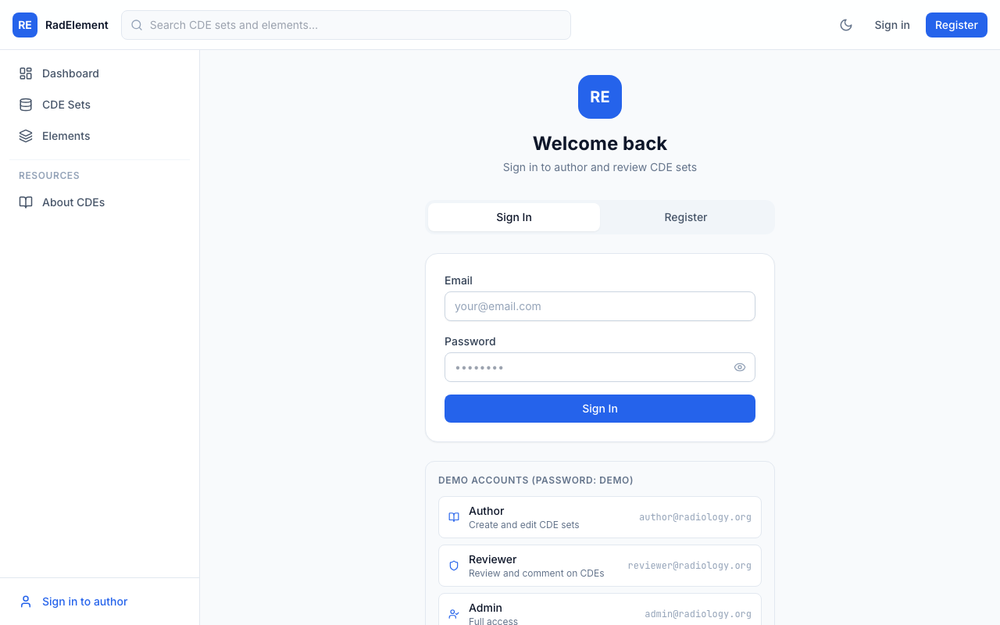
*Figure 2.1 — The login page. Demo accounts are available for testing.*

Enter your email and password, then click **Sign In**. The platform includes the following demo accounts (password: `demo` for all):

| Role | Email | Capabilities |
|------|-------|--------------|
| **Author** | author@radiology.org | Create and edit CDE sets |
| **Reviewer** | reviewer@radiology.org | Review and comment on submitted sets |
| **Admin** | admin@radiology.org | Full access |

> **Note:** This is a demonstration platform. All accounts and data are stored locally in your browser.

---

### 2.2 Navigation

After signing in you will see the main dashboard with a persistent left sidebar for navigation.

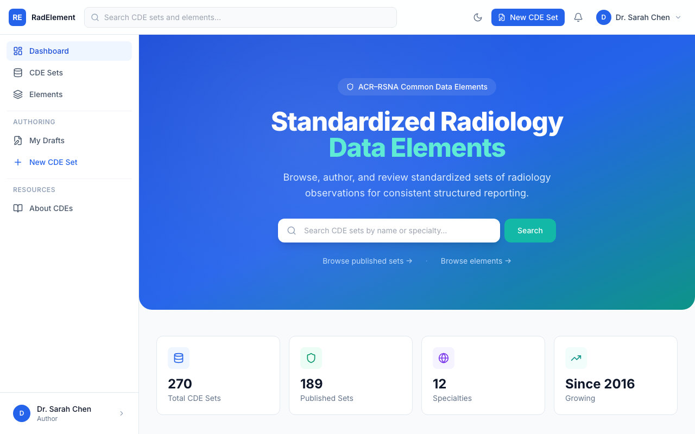
*Figure 2.2 — The main dashboard. The left sidebar provides access to all major sections.*

| Sidebar Item | Description |
|---|---|
| **Dashboard** | Home screen with platform statistics and recent sets |
| **CDE Sets** | Browse all published CDE sets |
| **Elements** | Browse all individual CDE elements |
| **My Drafts** | Your saved draft CDE sets in progress |
| **+ New CDE Set** | Start authoring a new CDE set |
| **About CDEs** | Reference material on the CDE standard |

The **top navigation bar** provides:
- **Search box** — Search all sets and elements by name or specialty
- **Dark mode toggle** — Switch between light and dark themes
- **New CDE Set button** — Quick access to start a new set
- **Notifications bell** — Review workflow notifications
- **User avatar** — Account menu

---

## 3. Browsing & Searching

### 3.1 Global Search

The search box in the top navigation bar searches across all published CDE sets and elements simultaneously.

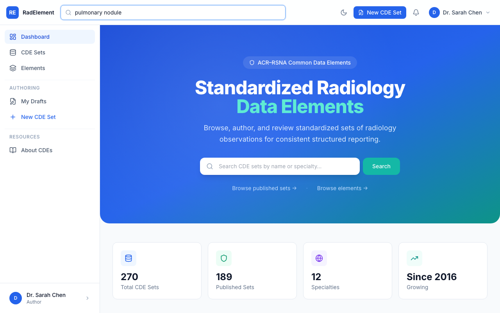
*Figure 3.1 — Global search returns matching CDE sets and elements as you type.*

Type at least two characters to activate search. Results appear in a dropdown organized by sets and elements. Click any result to navigate directly to it.

---

### 3.2 CDE Sets Browser

Click **CDE Sets** in the sidebar to browse all published sets.

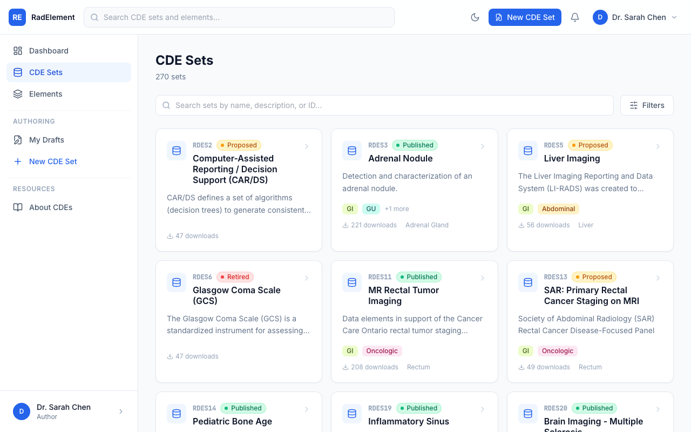
*Figure 3.2 — The CDE Sets browser. Sets can be filtered by specialty, modality, and status.*

From this page you can:
- Browse sets sorted by date or relevance
- Filter by specialty, modality, or status (published / draft / under review)
- Click a set to view its full details and elements

---

### 3.3 Elements Browser

Click **Elements** in the sidebar to browse all individual data elements across all published sets.

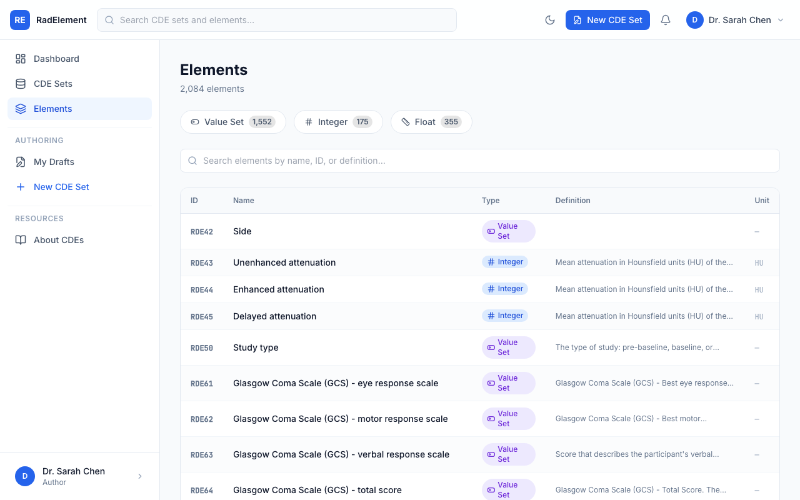
*Figure 3.3 — The Elements browser. Useful for finding an existing element before creating a new one.*

This is particularly useful when checking whether an element you intend to author already exists in the repository. Searching here before creating new elements helps avoid duplication.

---

## 4. Creating a New CDE Set

Click **+ New CDE Set** in the sidebar or the button in the top navigation bar. A new draft will be created and you will be taken to the CDE Editor.

### 4.1 Set Info Tab

The editor opens on the **Set Info** tab, where you provide the metadata that contextualizes all elements in the set.

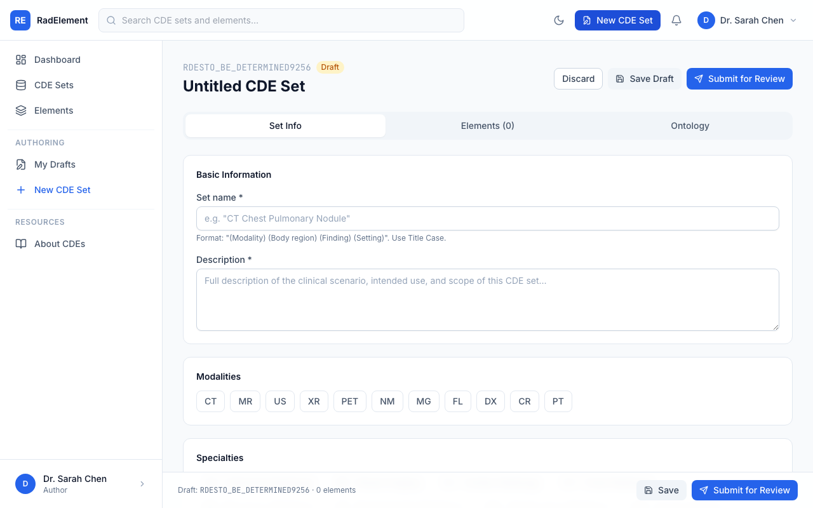
*Figure 4.1 — A new CDE Set editor with the Set Info tab active.*

#### Set Name

Enter the name of the CDE set in the **Set name** field.

> **Naming convention:** Follow the format `(Modality) (Body region) (Finding) (Setting)`. Use Title Case.
> Example: `CT Chest Pulmonary Nodule`

#### Description

Provide a full clinical description in the **Description** field. This should explain the clinical scenario the set addresses, its intended use, and the scope of elements it contains. A thorough description is required — the platform will warn you if it is too brief.

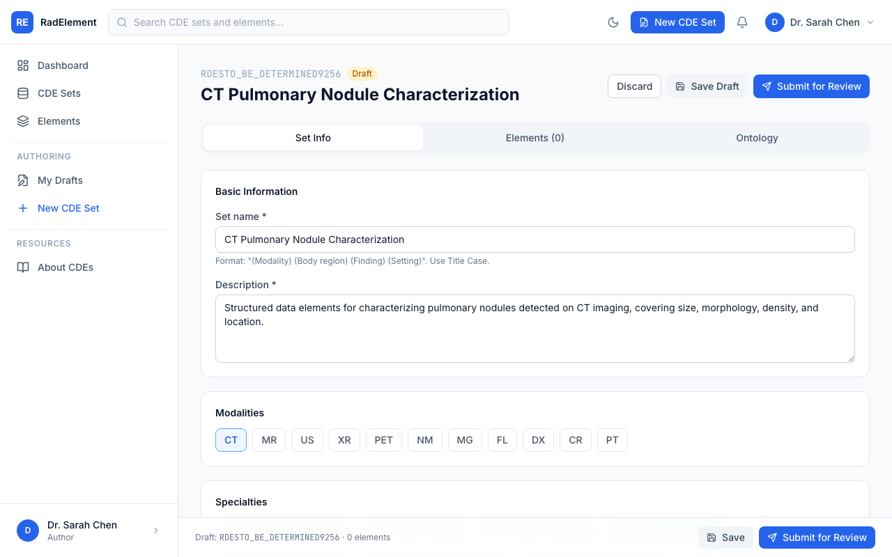
*Figure 4.2 — Set Info with name, description, CT modality, and Chest Radiology specialty selected.*

---

### 4.2 Modalities

Select all imaging modalities for which this CDE set is applicable by clicking the modality toggle buttons.

Available modalities: **CT, MR, US, XR, PET, NM, MG, FL, DX, CR, PT**

Buttons toggle on/off — highlighted buttons are selected. Multiple modalities can be selected.

---

### 4.3 Specialties

Select all relevant radiology specialties from the **Specialties** section. Like modalities, specialties are toggle buttons — click to select or deselect.

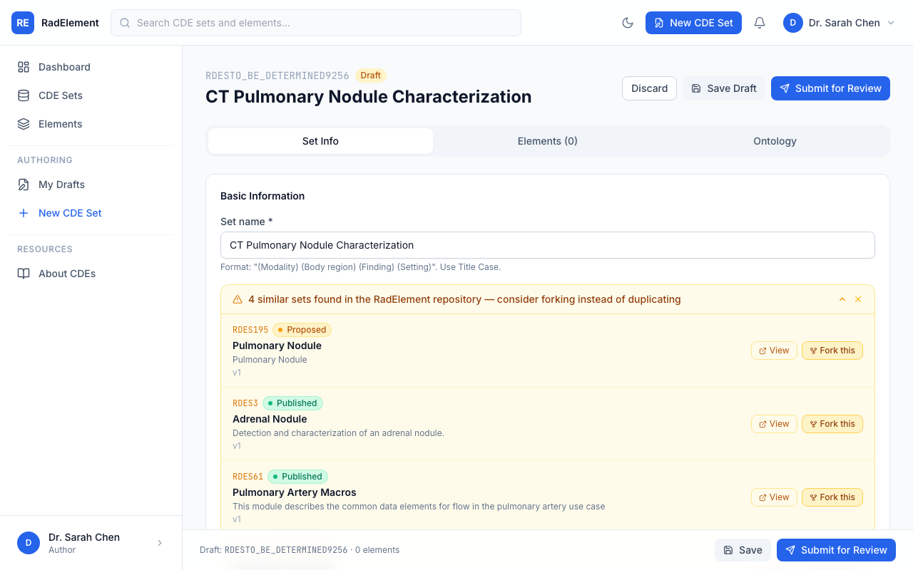
*Figure 4.3 — CT modality selected, CH – Chest Radiology specialty selected (highlighted with border).*

Available specialties include: AB (Abdominal), BR (Breast), CA (Cardiac), CH (Chest), ER (Emergency), GI (Gastrointestinal), GU (Genitourinary), HN (Head and Neck), IR (Interventional), MI (Molecular Imaging), MK (Musculoskeletal), NR (Neuroradiology), OB (OB-Gyn), OI (Oncologic), PD (Pediatric), QI (Quality Improvement), RS (Radiation Safety), VI (Vascular and Interventional).

---

### 4.4 Body Parts

The **Body Parts** section links the CDE set to specific anatomical locations using standardized ontology codes.

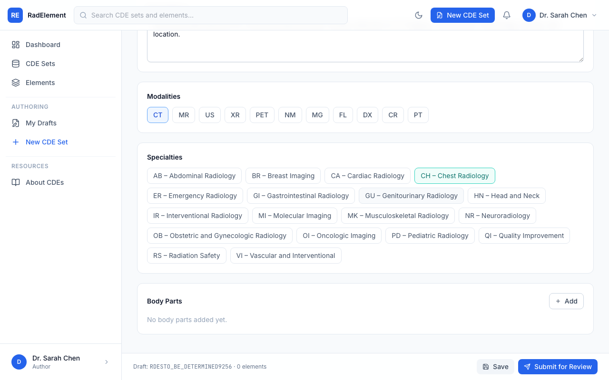
*Figure 4.4 — The Body Parts section at the bottom of the Set Info tab.*

Click **+ Add** to add a body part row. Type in the input field — a live ontology suggestion dropdown will appear, searching both **RadLex** and **SNOMED CT** simultaneously.

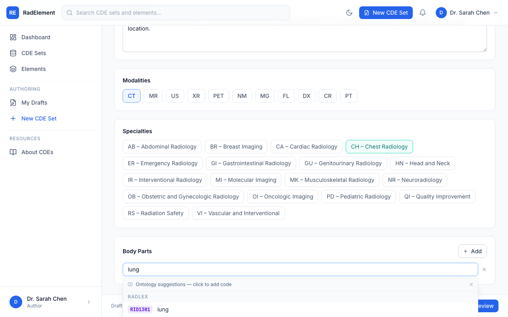
*Figure 4.5 — Typing "lung" in a body part field reveals RadLex matches (RID1301 "lung", etc.) with ontology codes.*

**To link an ontology code to a body part:**
1. Type the anatomical term in the body part input field
2. Wait ~300 ms for the suggestion dropdown to appear
3. Click the desired term from the **RadLex** or **SNOMED CT** section
4. The term name will fill the field and a **"1 code"** badge will appear next to it, confirming the ontology code was attached

You may add multiple body parts by clicking **+ Add** again. Remove a body part by clicking the **×** button at the end of the row.

---

## 5. Authoring Elements

Click the **Elements** tab at the top of the editor to switch to the element authoring view.

### 5.1 Adding an Element

When the set has no elements yet, the Elements tab shows an empty state with an **+ Add Element** button.

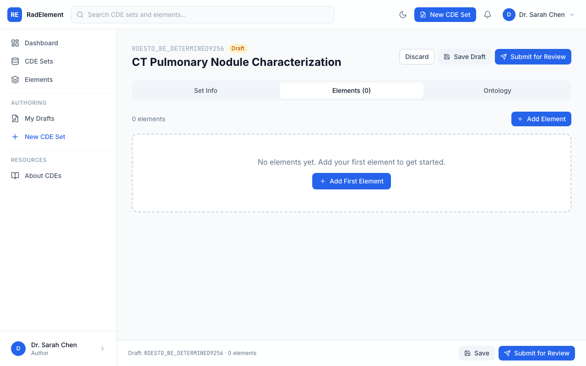
*Figure 5.1 — The Elements tab before any elements have been added.*

Click **+ Add Element** to add a new element. A new element card will appear, defaulting to **Value Set** type.

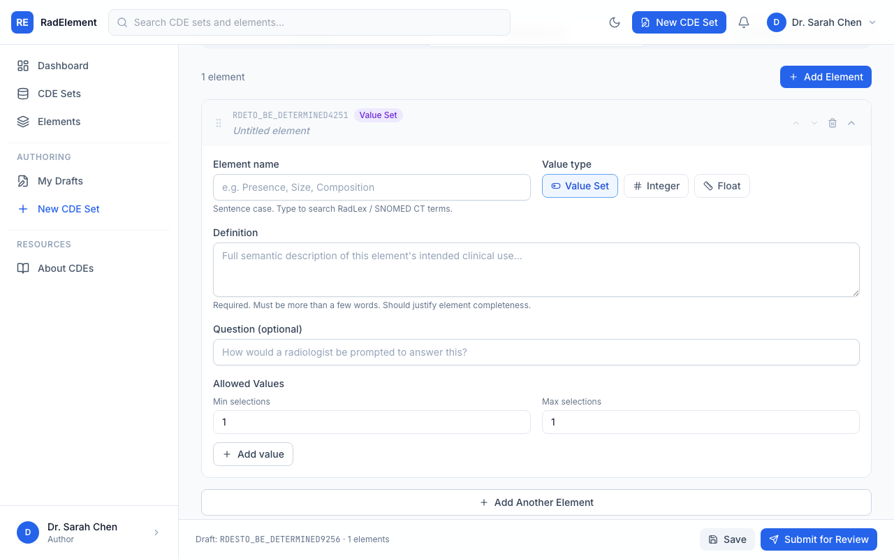
*Figure 5.2 — A new element card with Element name, Value type selector, Definition, and Question fields.*

---

### 5.2 Element Name & Ontology Suggest

Type the element name in the **Element name** field. As you type, a live ontology suggestion dropdown appears showing matching terms from **RadLex** (via NCBO BioPortal — full 34,000+ term lexicon) and **SNOMED CT**.

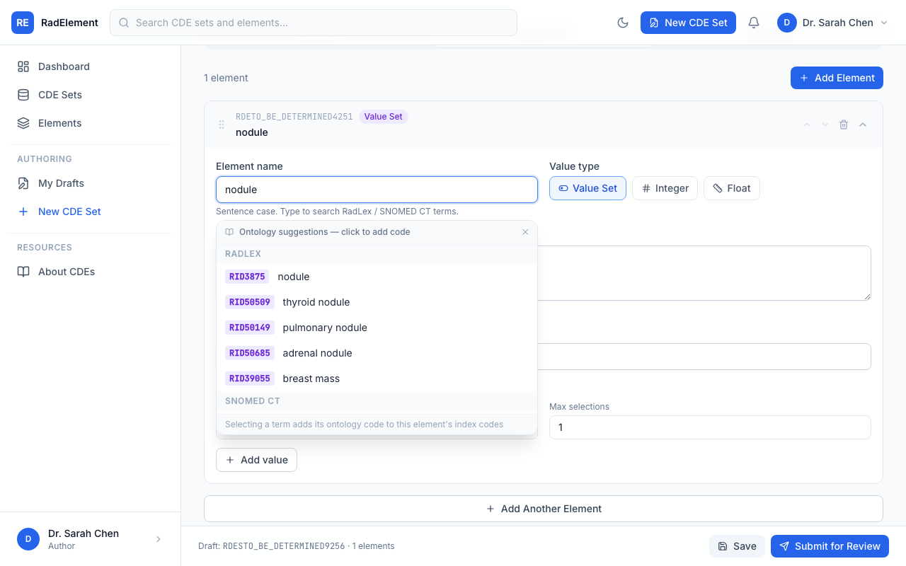
*Figure 5.3 — Typing "nodule" shows RadLex terms (RID3875 nodule, RID50509 thyroid nodule, etc.) and SNOMED CT terms.*

**How the ontology suggest works:**
- Results appear after a 300 ms debounce (to avoid overwhelming the API on every keystroke)
- The **RADLEX** section shows up to 5 results from the full BioPortal RadLex ontology, ranked by relevance
- The **SNOMED CT** section shows up to 7 results from the SNOMED International Snowstorm server
- Clicking a term fills the element name with the ontology display label and adds the ontology code (system, code, display) to the element's `index_codes`
- The **↗** icon next to each result opens the term in the external ontology browser (RadLex.org or SNOMED browser) in a new tab
- Press **Escape** or click the **✕** to close the dropdown without selecting

> **Tip:** You do not have to select a term from the dropdown — you can type any name you prefer. The ontology suggest is an optional enhancement that attaches machine-readable codes; it does not constrain what you can enter.

---

### 5.3 Duplicate Warning

After typing an element name, the platform automatically checks the RadElement repository for similar existing elements. If matches are found, a yellow warning banner appears below the name field.

*Figure 5.4 — The duplicate warning identifies similar elements already in the repository and recommends forking.*

The warning shows:
- The number of similar elements found
- A list of matching element IDs and names
- A recommendation to fork an existing element rather than creating a duplicate

> **Best practice:** Review the listed elements before proceeding. If an existing element meets your needs, consider referencing it rather than creating a new one. Duplicates fragment the standard and reduce interoperability.

---

### 5.4 Value Set Elements

A **Value Set** element presents a controlled list of choices (e.g., present / absent / indeterminate). This is the most common element type in radiology CDEs.

#### Value Type Selector

Use the **Value type** buttons to the right of the element name to select the type:

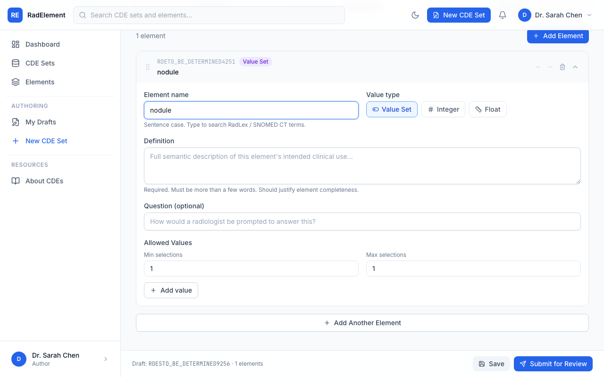
*Figure 5.5 — The three value types: Value Set (selected), Integer, and Float.*

#### Definition & Question

- **Definition** — A full semantic description of the element's intended clinical use. This field is required and must be substantive (more than a few words).
- **Question (optional)** — How this element would be phrased as a question to the radiologist in a structured reporting interface (e.g., "Is a pulmonary nodule present?").

#### Allowed Values

Scroll down to the **Allowed Values** section to configure the value set.

*Figure 5.6 — The Allowed Values section showing Min/Max selections and the Add value button.*

| Field | Description |
|---|---|
| **Min selections** | Minimum number of values the radiologist must choose (typically 1) |
| **Max selections** | Maximum number of values allowed (1 = single select, >1 = multi-select) |

Click **+ Add value** to add a value row. Each row contains:

| Column | Description |
|---|---|
| **Index (grey)** | Auto-assigned row number |
| **value** | Machine-readable code string (e.g., `present`, `absent`, `1`) |
| **Display name** | Human-readable label shown in reporting tools |
| **Definition** | Optional longer description of this specific value |
| **×** | Remove this value row |

#### Value Display Name Ontology Suggest

The **Display name** field in each value row supports the same ontology suggestion as the element name field. Clicking into the field and typing will show matching RadLex and SNOMED CT terms.

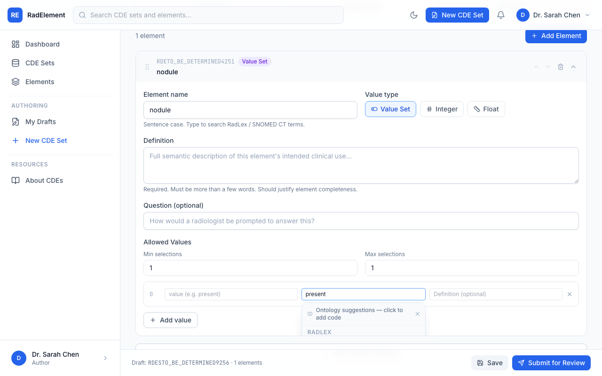
*Figure 5.7 — Typing "present" in a value's Display name field shows matching ontology terms for "present" from RadLex and SNOMED CT.*

When you select a term from the dropdown, the display name is filled and the ontology code is stored in the value's `index_codes`. A **"N code(s)"** badge appears next to the display name field to confirm the code was attached.

---

### 5.5 Integer Elements

Select **Integer** from the Value type buttons to author a numeric element that accepts whole-number responses.

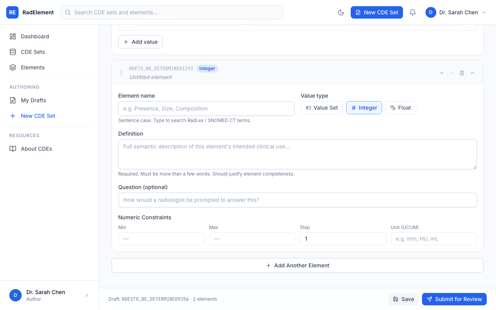
*Figure 5.8 — An Integer element showing the Numeric Constraints section (Min, Max, Step, Unit).*

#### Numeric Constraints

| Field | Description |
|---|---|
| **Min** | Minimum acceptable value (leave blank for no lower bound) |
| **Max** | Maximum acceptable value (leave blank for no upper bound) |
| **Step** | Increment size (default: 1 for integers) |
| **Unit (UCUM)** | Unit of measure in Unified Code for Units of Measure notation (e.g., `mm`, `HU`, `mL`) |

> **Example:** A "Nodule Size" element would have Min = 0, Max = 300, Step = 1, Unit = `mm`.

---

### 5.6 Float Elements

Select **Float** from the Value type buttons to author a numeric element that accepts decimal values (e.g., SUV measurements, attenuation values).

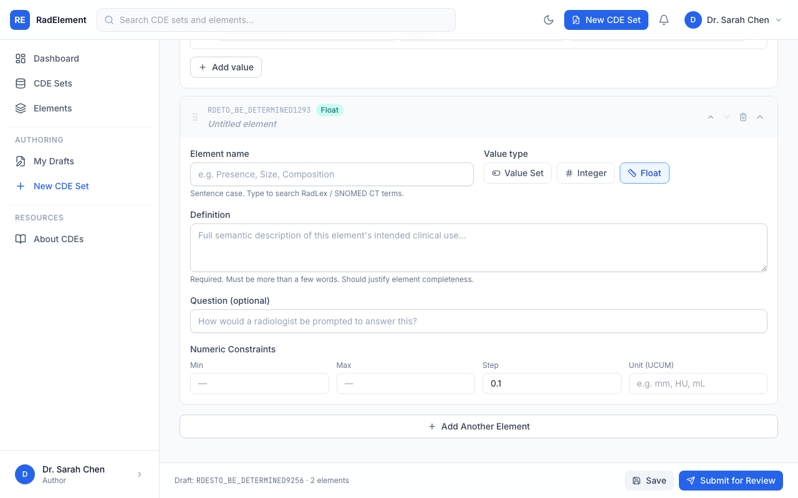
*Figure 5.9 — A Float element. The same Numeric Constraints fields apply as for Integer, but decimal precision is allowed.*

Float elements use the same Numeric Constraints fields (Min, Max, Step, Unit) as Integer elements. The Step field here accepts decimal values (e.g., `0.1` for one decimal place).

---

### 5.7 Reordering & Deleting Elements

Each element card has controls in its top-right corner:

| Control | Function |
|---|---|
| **↑ / ↓** arrows | Move the element up or down in the set order |
| **🗑 trash** icon | Delete the element |
| **▲ collapse** | Collapse the element card to save screen space |

Multiple elements can be open simultaneously. Click **+ Add Another Element** at the bottom of the page to add additional elements without scrolling to the top.

---

## 6. Ontology Tab

The **Ontology** tab provides a dedicated full-page search interface for looking up and attaching ontology codes to the CDE set as a whole (set-level `index_codes`).

Click the **Ontology** tab in the editor to access it.

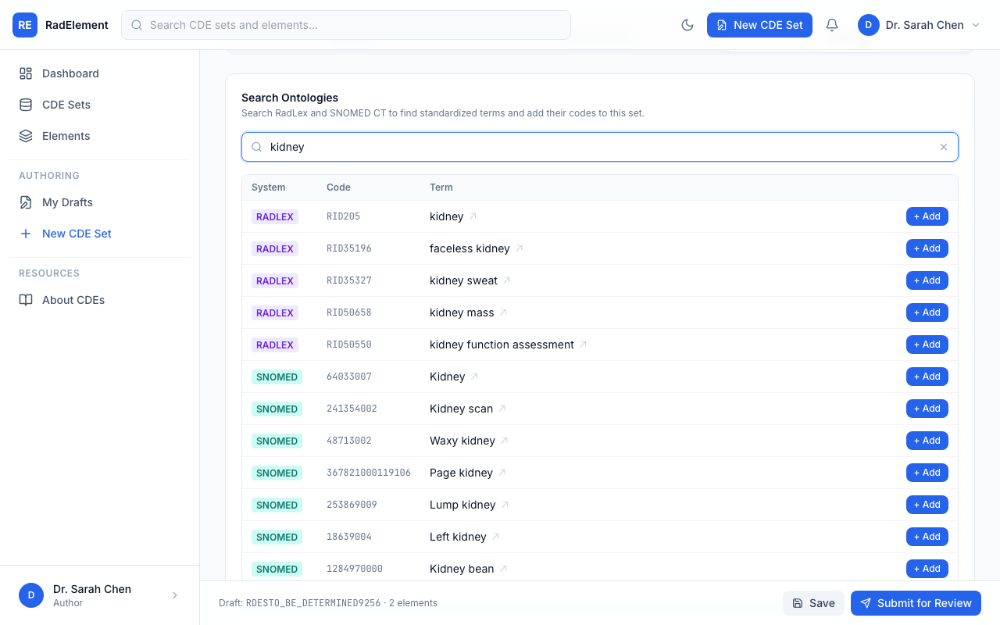
*Figure 6.1 — The Ontology tab. Searching "kidney" returns RadLex terms (purple badges) and SNOMED CT terms (teal badges), each with a "+ Add" button.*

#### Searching

Type a clinical term in the search box. Results appear in a table with columns:

| Column | Description |
|---|---|
| **System** | Source ontology: **RADLEX** (violet badge) or **SNOMED** (teal badge) |
| **Code** | The ontology's unique identifier (e.g., `RID205` or `64033007`) |
| **Term** | Human-readable label. The **↗** icon opens the term in the external ontology browser |
| **+ Add** | Adds this code to the set's index codes |

#### Adding Codes

Click **+ Add** next to any term to attach it to the CDE set. The button will change to show the code has been added, and the set's `index_codes` array will be updated. These set-level codes declare what clinical concepts the entire CDE set covers — useful for downstream discovery and FHIR integration.

> **RadLex vs. SNOMED:** RadLex is purpose-built for radiology and is the preferred source for imaging findings and anatomy. SNOMED CT is a broader clinical terminology useful for clinical conditions, procedures, and body structures. Both are shown together and either can be used.

---

## 7. Saving & Submitting

The editor status bar and action buttons appear consistently at the top of every editor screen.

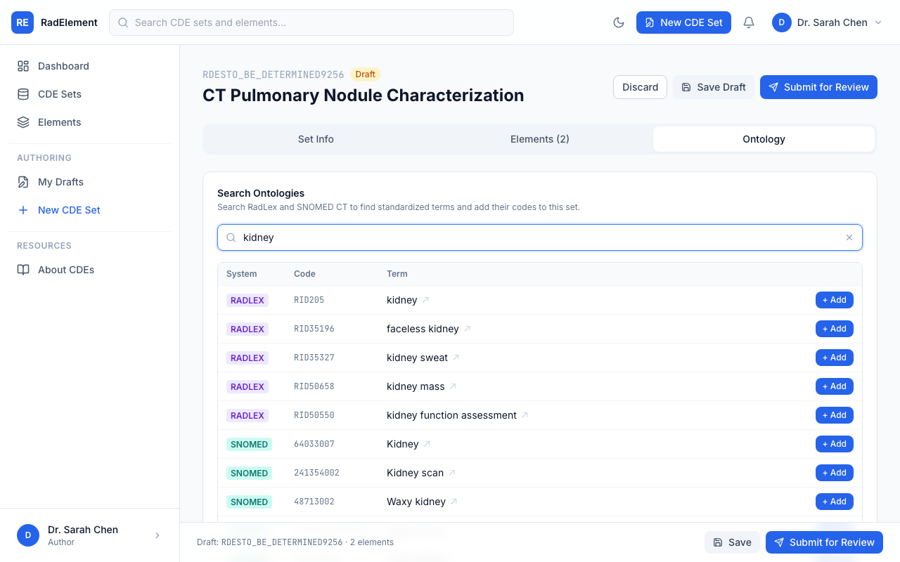
*Figure 7.1 — The editor toolbar with Discard, Save Draft, and Submit for Review buttons.*

| Button | Action |
|---|---|
| **Discard** | Discard unsaved changes and revert to the last saved state (or delete the draft if it was never saved) |
| **Save Draft** | Save the current state as a draft. The set remains private and editable. |
| **Submit for Review** | Submit the set for editorial review. Status changes to "Under Review" and the set becomes visible to Reviewers. |

The bottom status bar shows the draft ID and element count in real time (e.g., "Draft: RDESTO_BE_DETERMINED4142 · 2 elements").

> **Tip:** Save drafts frequently. The platform does not auto-save. Navigating away without saving will prompt a warning.

---

## 8. My Drafts

Click **My Drafts** in the sidebar to see all draft CDE sets you are currently working on.

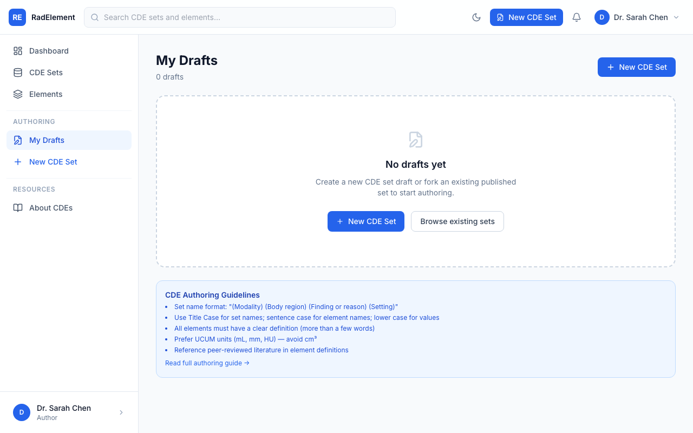
*Figure 8.1 — The My Drafts page lists all in-progress sets with their status and last modified date.*

From this page you can:
- **Resume editing** a draft by clicking its card
- See the current **status** of each set (Draft / Under Review / Published)
- See the element count and last modified timestamp

---

## 9. Appendix: Ontology Sources

The platform queries two live ontology services to power all suggestion features:

### RadLex (via NCBO BioPortal)

- **Coverage:** 34,000+ radiology-specific terms maintained by RSNA
- **Use cases:** Imaging findings, anatomy, procedures, measurements
- **Code format:** `RID` prefix followed by a number (e.g., `RID3875`)
- **API:** NCBO BioPortal — `https://data.bioontology.org/search?ontologies=RADLEX`
- **Browser:** [radlex.org](https://radlex.org)

### SNOMED CT (via Snowstorm)

- **Coverage:** ~350,000 clinical concepts covering diseases, anatomy, procedures, and findings
- **Use cases:** Clinical conditions, body structures, observable entities
- **Code format:** Numeric concept ID (e.g., `39607008`)
- **API:** SNOMED International Snowstorm public server — `https://browser.ihtsdotools.org/snowstorm`
- **Browser:** [browser.ihtsdotools.org](https://browser.ihtsdotools.org)

### Where Ontology Codes Appear

| Location | How to attach codes |
|---|---|
| **Element name** | Type in the Element name field → select from the inline dropdown |
| **Body part name** | Type in a Body Part field → select from the inline dropdown |
| **Value display name** | Type in a value's Display name field → select from the inline dropdown |
| **Set-level codes** | Use the dedicated **Ontology** tab search + "+ Add" |

All attached codes are stored in `index_codes` arrays on the respective object (set, element, or value) and are exported in the standard RadElement JSON schema for downstream consumption.

---

*RadElement CDE Authoring Platform · ACR–RSNA Common Data Elements · © 2026*
